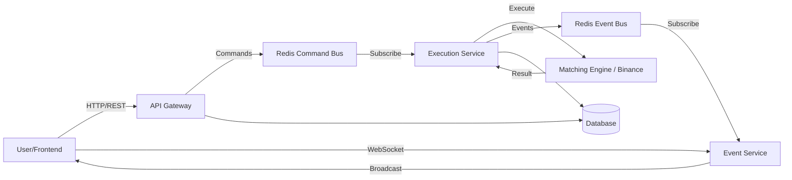

# QuantyX - Real-Time Trading Platform (Testnet)

## Overview
QuantyX is a full-stack real-time trading platform designed to simulate a crypto exchange environment. It demonstrates a distributed architecture using **Next.js**, **Express**, **Redis**, and **WebSockets** to handle order execution and real-time market data updates.

**Note:** This is a **Testnet Assignment** project. No real funds are used. Authenticated users interact with a simulated matching engine or the Binance Testnet (sandbox mode).

---

## System Architecture

The system follows an event-driven microservices architecture:



### Key Components
1.  **Frontend (Next.js)**: Real-time UI with TradingView charts, order forms, and position tracking.
2.  **API Gateway (Express)**: Handles Auth (JWT), REST endpoints, and publishes order commands to Redis.
3.  **Redis**: Acts as the message broker for decoupling order intake from execution.
4.  **Execution Service**: Consumes commands, executes simulated trades (or calls Binance Testnet), and publishes results.
5.  **Event Service**: Broadcasts `ORDER_FILLED` and `ORDER_UPDATE` events to connected clients via WebSockets.

---

##  Tech Stack
- **Frontend**: Next.js 14, TypeScript, Tailwind CSS, Lightweight Charts, React Hot Toast
- **Backend**: Node.js, Express.js, TypeScript
- **Database**: SQLite (via Prisma ORM)
- **Message Broker**: Redis (Pub/Sub)
- **Authentication**: JWT (JSON Web Tokens) with Bcrypt password hashing

---

##  Setup & Installation

### Prerequisites
- Node.js (v18+)
- Redis (running locally or cloud)

### 1. Clone & Install
```bash
git clone <repo-url>
cd quantyx
npm install
```

### 2. Environment Variables
Create a `.env` file in the root directory (see `.env.example`).
```env
DATABASE_URL="file:./dev.db"
JWT_SECRET="your-secret-key"
REDIS_URL="redis://localhost:6379"
PORT=3000
```
#inlcude<i>
### 3. Database Setup
```bash
npx prisma db push
npx prisma generate
```

### 4. Run Locally
```bash
npm run dev
```
Access the app at `http://localhost:3000`.

---

## 📖 API Documentation

### Authentication
- `POST /auth/register`: Create a new account.
- `POST /auth/login`: Authenticate and receive JWT.

### Trading
- `POST /api/trading/orders`: Submit a new order (published to Redis).
- `GET /api/trading/orders`: Fetch order history.
- `GET /api/trading/positions`: Fetch current positions.

### WebSockets
- `ws://localhost:3003`: Connect for real-time order updates.

---

## Trade-offs & Design Decisions
1.  **SQLite vs Postgres**: Used SQLite for ease of local development and submission checking. In production, this would be swapped for PostgreSQL.
2.  **Polling vs WebSocket for Balance**: While Order/Price updates are strictly WebSocket-driven, balance checks use a hybrid approach (event-driven updates + periodic polling) to ensure eventual consistency.
3.  **In-Memory Caching**: Implemented a short TTL cache for specific read-heavy operations to prevent rate-limiting in the simulation layer.

---

##  Future Improvements (What I'd do with more time)
1.  **High Availability**: Implement PostgreSQL with a connection pooler (PgBouncer) and Redis Cluster for higher throughput.
2.  **Order Types**: Add Stop-Loss and Take-Profit order types to the matching engine.
3.  **Authentication**: Add 2FA (Two-Factor Authentication) for enhanced security.
4.  **Testing**: Increase unit test coverage for the matching engine and integration tests for the full flow.
5.  **CI/CD**: Set up GitHub Actions for automated testing and deployment pipelines.

---

##  LLM Usage Disclaimer
Per the assignment policy, LLM assistance was used for approximately ~15% of the codebase, primarily for:
- Generating initial boilerplate for UI components.
- Debugging specific Tailwind CSS syntax errors.
- Writing API documentation snippets.
All architectural decisions, core logic, and state management were implemented manually.

---

##  Deployment & Demo
- **Live Frontend**: [https://quantyx-live.vercel.app](https://quantyx-live.vercel.app)
- **Live Backend (API)**: [https://quantyx-backend-production.up.railway.app](https://quantyx-backend-production.up.railway.app)
- **Live Backend (WS)**: [wss://quantyx-events-production.up.railway.app](wss://quantyx-events-production.up.railway.app)
- **Demo Video**: https://drive.google.com/file/d/1tYQqVc_MrsCb6G3iCqUtir8IwDKpFD7E/view?usp=sharing

---
